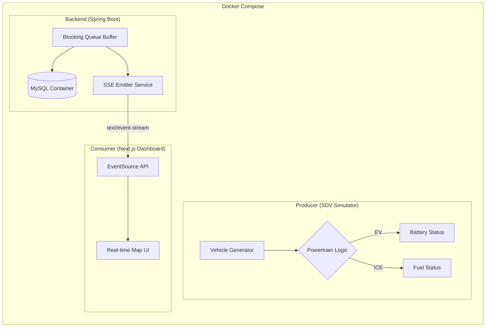

# Mobility Data Streamer: Real-time SDV Monitoring Platform

> **다양한 모빌리티(SDV)에서 발생하는 대규모 실시간 데이터를 안정적으로 수집하고 시각화하는 Full-stack PoC 프로젝트입니다.**

본 프로젝트는 차량 데이터 플랫폼 기술 스택과 비즈니스 방향성을 타겟으로 설계되었습니다. 단순히 데이터를 보여주는 것을 넘어, 이기종(Heterogeneous) 모빌리티 데이터의 다형성 처리와 실시간 스트리밍의 안정성에 초점을 맞췄습니다.

---

## Key Features

- **Multi-Type Mobility Simulation:** `@Scheduled` 백그라운드 워커(`VehicleDataProducer`)가 1초 단위로 REGULAR·FREIGHT·MICRO 3가지 타입을 섞어 최소 5대의 가상 주행 데이터를 생성 후 인메모리 버퍼(`VehicleDataBuffer`)에 적재. 버퍼 초과 시에도 스레드가 죽지 않는 Fault-tolerance 설계.
- **SDV Data Modeling:** Kotlin `sealed interface`로 `Vehicle` 도메인을 설계하여 `EvVehicle`(배터리)/`IceVehicle`(연료)의 파워트레인 다형성을 타입 안전하게 구현. `init { require(...) }`로 잘못된 도메인 조합(MICRO+ICE)을 생성 시점에 즉시 차단.
- **Real-time Streaming (SSE):** `SseEmitterService`를 통해 HTTP 기반의 실시간 단방향 브로드캐스팅 구현. 다중 클라이언트 관리에 `CopyOnWriteArrayList`를 채택하여 Thread-safe를 보장하며, 통신 장애(IOException) 시 죽은 커넥션을 자동으로 정리(Self-healing)하여 서버 리소스를 보호.
- **Persistence & History:** MySQL을 활용하여 실시간 관제 데이터의 시계열 로깅 및 영속성 확보.
- **Live Dashboard:** Next.js와 TypeScript 기반으로 차량 타입 및 상태별 동적 마커 렌더링.

---

## Tech Stack

### Backend

- **Language:** Kotlin (JVM)
- **Framework:** Spring Boot 3.x
- **Database:** MySQL (Spring Data JPA)
- **Communication:** Server-Sent Events (SSE)

### Frontend

- **Framework:** Next.js (App Router), React
- **Language:** TypeScript
- **UI/UX:** CSS Modules / Tailwind CSS, Map API (Google/Kakao)

### DevOps

- **Containerization:** Docker, Docker Compose
- **Services:** MySQL, Spring Boot, Next.js 전체를 컨테이너로 오케스트레이션

### Engineering

- **Methodology:** SDD (Spec Driven Development), TDD (Test Driven Development)
- **Testing:** JUnit5, AssertJ, MockMvc

---

## System Architecture

본 시스템은 Docker Compose로 전체 인프라를 오케스트레이션하며, In-memory Buffering과 Event Streaming 아키텍처를 따릅니다.



---

## Engineering Philosophy

### Spec Driven Development (SDD)

모든 개발은 docs/SPEC.md와 docs/ARCHITECTURE.md 정의에서 시작됩니다. 요구사항을 기술 스펙으로 먼저 정의함으로써 설계의 일관성을 유지하고, 변경 사항 발생 시 문서를 선제적으로 업데이트합니다.

### Test Driven Development (TDD)

도메인 로직의 신뢰성을 위해 JUnit5를 활용한 테스트 코드를 프로덕션 코드보다 먼저 작성합니다. 특히 차량 타입별 제약 조건과 다형성 모델링을 검증하는 데 집중하여 런타임 에러를 최소화합니다.

---

## Getting Started

### Prerequisites

- **Docker Desktop** (Docker Engine 20.10+ & Docker Compose V2)
- Java 17+ / Kotlin 1.9+ (로컬 개발 시)
- Node.js 18+ (로컬 개발 시)

### Docker로 전체 시스템 기동 (권장)

```bash
# .env.example을 복사하여 환경 변수 설정
cp .env.example .env

# 전체 시스템 기동 (빌드 포함)
docker compose up --build

# 백그라운드 실행
docker compose up -d

# 종료 및 볼륨 정리
docker compose down -v
```

### 로컬 개발 (Docker 없이)

#### 백엔드 단독 실행

```bash
./gradlew bootRun
```

#### 프론트엔드 단독 실행

```bash
npm install
npm run dev
```

---

## Documentation Hierarchy

- [docs/SPEC.md](https://www.google.com/search?q=./docs/SPEC.md): 비즈니스 요구사항 및 기능 상세 명세
- [docs/ARCHITECTURE.md](https://www.google.com/search?q=./docs/ARCHITECTURE.md): 기술적 의사결정 이유 및 상세 설계도
- [docs/SKILL.md](https://www.google.com/search?q=./docs/SKILL.md): 프로젝트에 적용된 핵심 기술셋 정리
