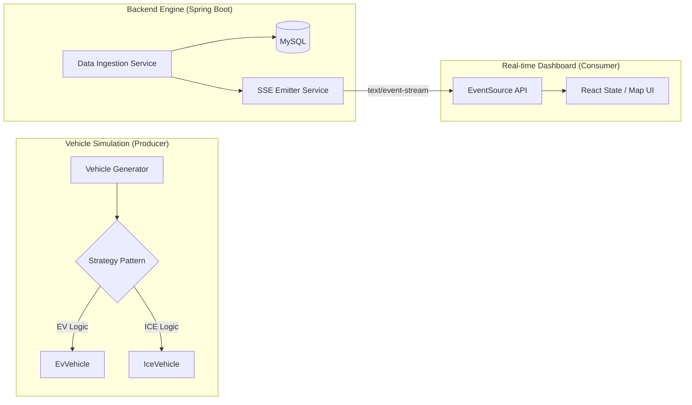
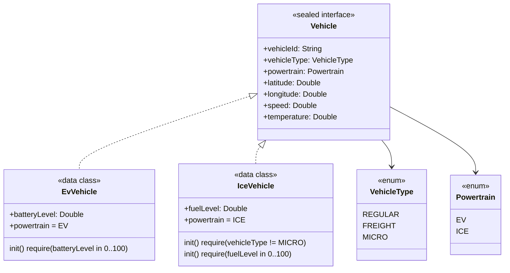

# 🏛️ System Architecture Design: Mobility Data Pipeline

이 문서는 PoC 프로젝트의 기술적 의사결정, 데이터 흐름, 그리고 객체 지향 설계 원칙을 상세히 다룹니다.

## 1. High-Level System Design

전체 시스템은 **생산자(Vehicle Simulator) - 중계자(Spring Boot) - 소비자(Next.js Dashboard)**의 3단계 구조로 설계되었습니다.

---

## 2. Domain Modeling: Vehicle Polymorphism ([Spec 1.1])

`sealed interface`를 활용한 EV/ICE 다형성 모델입니다. **컴파일 타임 타입 안전성**과 **생성 시점 유효성 검증(Fail-fast)**을 동시에 보장합니다.

### 핵심 설계 결정

| 결정                                 | 이유                                                                                  |
| ------------------------------------ | ------------------------------------------------------------------------------------- |
| `sealed interface` 사용              | `when` 분기 시 컴파일러가 모든 하위 타입을 강제 처리 → 런타임 오류 원천 차단          |
| `data class` 사용                    | 불변성(`val`) + `equals/hashCode/copy` 자동 생성으로 보일러플레이트 제거              |
| `powertrain`을 computed `val`로 선언 | 구현체 타입과 파워트레인의 불일치를 컴파일 타임에 방지                                |
| `init { require(...) }` 사용         | 도메인 불변식을 생성 시점에 즉시 검증(Fail-fast), 잘못된 상태의 객체가 생성될 수 없음 |
| MICRO + ICE 조합 금지                | MICRO 모빌리티(킥보드/자전거)는 물리적으로 연소 엔진 탑재 불가                        |
