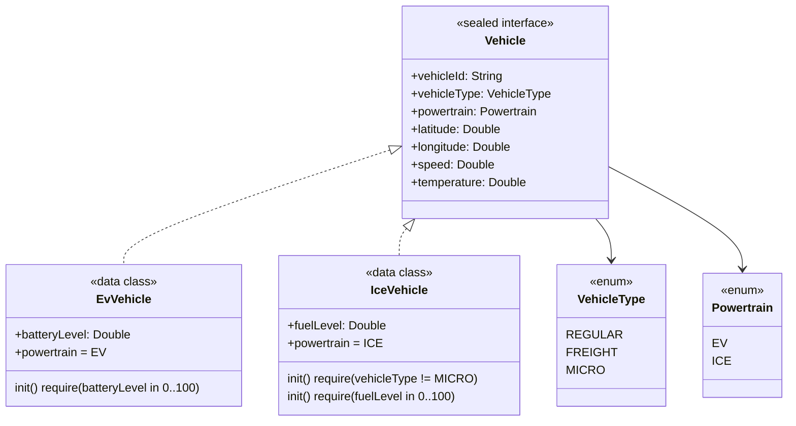

# 🏛️ System Architecture Design: Mobility Data Pipeline

이 문서는 PoC 프로젝트의 기술적 의사결정, 데이터 흐름, 그리고 객체 지향 설계 원칙을 상세히 다룹니다.

## 1. High-Level System Design

전체 시스템은 **생산자(Vehicle Simulator) - 중계자(Spring Boot) - 소비자(Next.js Dashboard)**의 3단계 구조로 설계되었습니다.

```mermaid
graph LR
    subgraph "Vehicle Simulation (Producer)"
        A[VehicleDataProducer] -->|@Scheduled 1s| B[VehicleDataGenerator]
        B --> C{VehicleType}
        C -->|REGULAR/FREIGHT EV| D[EvVehicle]
        C -->|REGULAR/FREIGHT ICE| E[IceVehicle]
        C -->|MICRO EV 고정| D
        D & E -->|offerAll| F[VehicleDataBuffer]
    end

    subgraph "Backend Engine (Spring Boot)"
        E[VehicleDataBroadcaster] -->|@Scheduled 1s| F[VehicleDataBuffer]
        F -->|poll| E
        E -->|hasClients?| G[SseEmitterService]
        E -->|Entity Mapping| H[(MySQL)]
    end

    subgraph "Real-time Dashboard (Consumer)"
        G -->|text/event-stream| I[EventSource API]
        I --> J[React State / Map UI]
    end
```

---

## 3. Producer Layer: VehicleDataGenerator ([Spec 1.1])

`@Component`로 등록된 `VehicleDataGenerator`는 `generate()` 호출당 **최소 5대**의 가상 주행 데이터를 생성합니다.

### 3.1. 생성 전략 (Fixed Composition)

| VehicleType | Powertrain  | 대수 | 속도 범위  |
| ----------- | ----------- | ---- | ---------- |
| REGULAR     | EV          | 1대  | 30~80 km/h |
| REGULAR     | ICE         | 1대  | 30~80 km/h |
| FREIGHT     | EV          | 1대  | 40~60 km/h |
| FREIGHT     | ICE         | 1대  | 40~60 km/h |
| MICRO       | **EV 고정** | 1대  | 10~25 km/h |

> **MICRO+ICE 방어**: MICRO 타입은 항상 `createEvVehicle()`을 호출하여 도메인 불변식(`IceVehicle.init` 예외)을 트리거하지 않도록 설계.

### 3.2. 실시간 스케줄링 및 버퍼 적재 (`VehicleDataProducer`)

- `@Scheduled(fixedRate = 1000)` 어노테이션을 사용하여 **1초(1000ms)** 단위로 위 생성 전략에 따라 데이터를 생산합니다.
- 생성된 데이터는 `VehicleDataBuffer`(thread-safe `LinkedBlockingQueue(1000)`)에 `offerAll`로 삽입됩니다.
- **Fault-tolerance:** 인메모리 버퍼가 가득 차서(Capacity 1000 초과) `IllegalStateException`이 발생할 경우, 스케줄러 스레드가 죽는 것을 방지하기 위해 내부적으로 예외를 캐치(catch) 후 `Warning` 로그만 남기며 다음 1초 주기를 정상적으로 대기합니다.

### 3.3. 좌표 생성 범위

- **위도(latitude):** `37.4 ~ 37.7` (서울 시내)
- **경도(longitude):** `126.8 ~ 127.2` (서울 시내)
- `kotlin.random.Random.nextDouble(min, max)`으로 매 호출마다 다른 좌표 생성.

---

## 4. Real-time Streaming (SSE) Layer: SseEmitterService ([Spec 1.3])

단방향 리얼타임 데이터 전송을 위한 딜리버리 시스템입니다. 연결된 다수의 클라이언트를 안전하게 관리하기 위한 전략이 적용되었습니다.

### 클라이언트 커넥션 관리 (Thread-Safety)

- **컬렉션 선택:** 브로드캐스팅(순회 탐색) 작업이 잦은 특성을 고려하여 `CopyOnWriteArrayList<SseEmitter>`를 사용해 다중 스레드 환경에서 데이터 정합성을 보장합니다.
- **Fail-Safe Iteration:** 순회 중 목록이 변경되어도 `ConcurrentModificationException`이 발생하지 않습니다.

### 연결 정리 및 에러 핸들링 (Cleanup & Self-healing)

1. **명시적 종료:** 클라이언트 측에서 연결이 종료되거나(Timeout, Completion), 서버 측 에러가 발생한 경우 콜백(`onCompletion`, `onTimeout`, `onError`)에 의해 해당 클라이언트가 리스트에서 즉시 `.remove()` 됩니다.
2. **브로드캐스팅 중 예외 허용:** 데이터를 `send`하는 도중 클라이언트 네트워크 문제로 `IOException`이 발생하더라도, 이를 즉시 `try-catch`로 포착합니다. 전체 서버 로직이나 타 클라이언트의 전송 흐름을 블로킹하지 않고, 에러가 발생한 단일 Emitter만 리스트에서 안전하게 제거하여 **자가 치유(Self-healing)** 메커니즘을 작동시킵니다.
3. **더미 이벤트 전송:** 커넥션 직후 Nginx/Proxy의 503 Timeout 방지를 위해 연결 성공("INIT") 이벤트를 즉각 1회 발송합니다.

---

## 5. Consumer/Broadcaster Layer: VehicleDataBroadcaster ([Spec 1.3])

인메모리 버퍼(`VehicleDataBuffer`)에서 데이터를 꺼내어(Consume) 실제 클라이언트 쪽으로 쏘아보내는(Broadcast) 스케줄러입니다.

### 5.1. 실시간 스케줄링 및 큐 순회

- `@Scheduled(fixedRate = 1000)` 어노테이션을 사용하여 1초 단위로 버퍼에서 데이터를 소비합니다.
- 한 번 스케줄러가 깰 때마다 버퍼(`LinkedBlockingQueue`)가 비워질 때까지 반복해서 꺼내어(`poll`) 가져갑니다.

### 5.2. 트래픽 최적화 (Connection-Aware Strategy)

1. **접속자 0명 시의 최적화:** `SseEmitterService`에 연결된 클라이언트가 1명도 없다면, `buffer.poll()` 순회 및 `broadcast()` 호출을 아예 건너뜁니다(Early Return).
2. **배경:** 접속자가 없는데 데이터를 꺼내거나 JSON으로 직렬화할 이유가 없기 때문입니다. 이를 통해 **서버 CPU 리소스와 메모리 할당을 획기적으로 절약**할 수 있습니다.
3. **버퍼 관리 정책 (Drop-newest):** 접속자가 0명이면 데이터를 비우지 않기 때문에 버퍼엔 금세 최대 용량(1000)이 찹니다. 이 때 데이터를 쌓는 `VehicleDataProducer` 스케줄러 측에서 Capacity 한도를 초과해 발생하는 `IllegalStateException`을 조용히 catch하고 처리하기 때문에 가장 최신 생산된 데이터들이 자연스럽게 누락(Drop)됩니다. SSE 접속자가 존재할 때만 최신 데이터 스트리밍이 재개되므로 메모리 누수나 데드락 우려가 없습니다.

---

## 2. Domain Modeling: Vehicle Polymorphism ([Spec 1.1])

`sealed interface`를 활용한 EV/ICE 다형성 모델입니다. **컴파일 타임 타입 안전성**과 **생성 시점 유효성 검증(Fail-fast)**을 동시에 보장합니다.



### 핵심 설계 결정

| 결정                                 | 이유                                                                                  |
| ------------------------------------ | ------------------------------------------------------------------------------------- |
| `sealed interface` 사용              | `when` 분기 시 컴파일러가 모든 하위 타입을 강제 처리 → 런타임 오류 원천 차단          |
| `data class` 사용                    | 불변성(`val`) + `equals/hashCode/copy` 자동 생성으로 보일러플레이트 제거              |
| `powertrain`을 computed `val`로 선언 | 구현체 타입과 파워트레인의 불일치를 컴파일 타임에 방지                                |
| `init { require(...) }` 사용         | 도메인 불변식을 생성 시점에 즉시 검증(Fail-fast), 잘못된 상태의 객체가 생성될 수 없음 |
| MICRO + ICE 조합 금지                | MICRO 모빌리티(킥보드/자전거)는 물리적으로 연소 엔진 탑재 불가                        |
