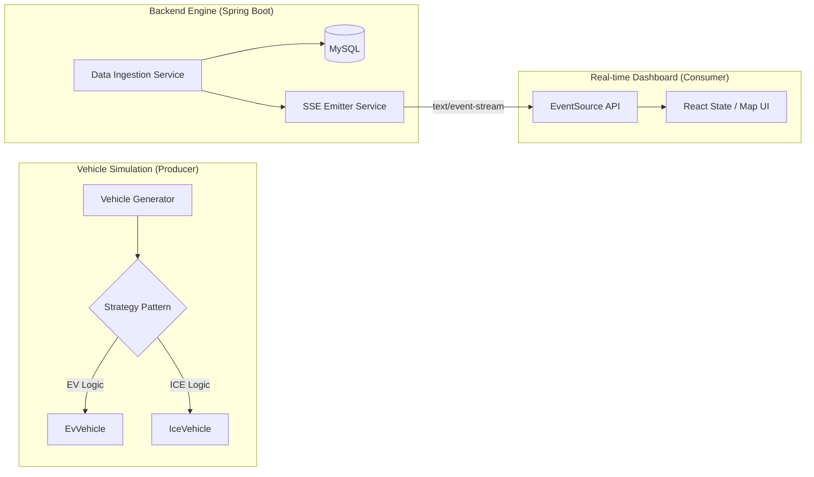

# 🏛️ System Architecture Design: Mobility Data Pipeline

이 문서는 모다플 PoC 프로젝트의 기술적 의사결정, 데이터 흐름, 그리고 객체 지향 설계 원칙을 상세히 다룹니다.

## 1. High-Level System Design

전체 시스템은 **생산자(Vehicle Simulator) - 중계자(Spring Boot) - 소비자(Next.js Dashboard)**의 3단계 구조로 설계되었습니다.

